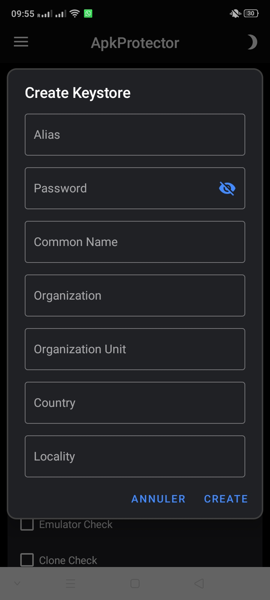
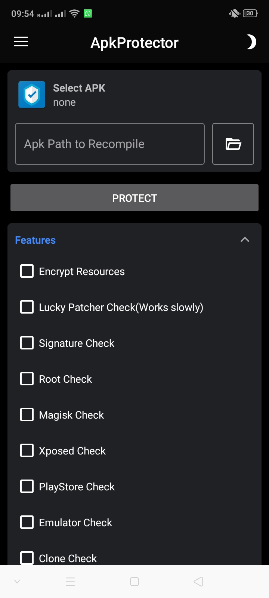

# APKPROTECTOR PREMIUM
ApkProtector Premium is the protector and obfuscator of Android applications. It helps you secure your applications and libraries against unauthorized or illegal use, reverse engineering, and cracking.

### 📷 SCREENSHOTS

### ⚙️ FEATURES & Experemental features

* Encrypt Resources
* Lucky Patcher Check
* Signature Check
* Root Check
* Magisk Check
* Xposed Check
* PlayStore Check
* Emulator Check
* Clone Check
* Hook Check
* Checking illegal code
* Crash Notification
* Check VPN
* Welcome Message
* Debug Check
* Title Notification
* Custom Application Name

* Device Lock
* Show Splash

### 📖 HOW TO INSTALL

1. Download APK & install it

To learn more please watch this video: https://youtu.be/8JHCzasirHI

### 💰 Donate

If you like my work, consider buying me a coffee :)

Bitcoin > 17qcsGD3FTckSqHLH4PE4XfRtcktgAZTJm

⚠️ We are not responsible on how you use this tool. 
